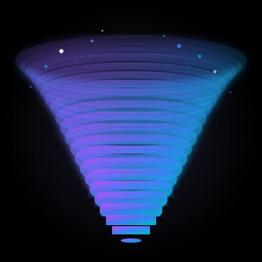

# 🌌 NebulaTorrent

<div align="center">



**Премиальный торрент-клиент с AMOLED интерфейсом**

[](LICENSE)
[](https://www.electronjs.org/)
[](https://reactjs.org/)

[Скачать](https://github.com/yourusername/nebula-torrent/releases) • [Документация](#-возможности) • [Сборка](#-сборка-из-исходников)

</div>

---

## ✨ Возможности

### 🎨 Премиальный интерфейс
- **4 темы оформления**: AMOLED, Киберпанк, Матрица, Светлая
- **Glassmorphism эффекты** с размытием и прозрачностью
- **Плавные анимации** и современный дизайн
- **Кастомный title bar** без стандартных элементов Windows

### 🚀 Полноценный торрент-клиент
- **TCP/UDP поддержка** - работает как qBittorrent/uTorrent
- **Magnet ссылки** - полная поддержка
- **Drag & Drop** - перетаскивание .torrent файлов
- **Управление загрузками**: пауза, продолжить, удалить
- **Статистика в реальном времени**: скорость, пиры, прогресс

### 🎬 Встроенный медиаплеер
- **HTTP streaming** - воспроизведение во время загрузки
- **Поддержка форматов**: MP4, WebM, MKV, AVI, MOV
- **HTML5 плеер** с полным набором контролов

### � Мультиязычность
- **Русский язык** по умолчанию
- **English** - полная поддержка
- Переключение в настройках

### 💾 Системная интеграция
- **Ассоциация с .torrent файлами** - открытие двойным кликом
- **Поддержка magnet:// протокола** - клик по ссылке
- **Системный трей** - сворачивание в трей
- **Автозапуск торрентов** при открытии файлов

---

## 📸 Скриншоты

<div align="center">

### Главный экран


### Темы оформления


### Встроенный плеер


</div>

---

## 🚀 Быстрый старт

### Установка из релиза

1. Скачайте `NebulaTorrent-Setup-1.0.0.exe` из [Releases](https://github.com/yourusername/nebula-torrent/releases)
2. Запустите установщик
3. Следуйте инструкциям мастера установки
4. Готово! 🎉

### Запуск из исходников

```bash
# Клонируйте репозиторий
git clone https://github.com/yourusername/nebula-torrent.git
cd nebula-torrent

# Установите зависимости
npm install

# Запустите приложение
npm start
```

---

## � Сборка из исходников

### Требования

- Node.js 16+ 
- npm 8+
- Windows 10/11 (для сборки Windows установщика)

### Шаги сборки

1. **Клонируйте репозиторий**
```bash
git clone https://github.com/yourusername/nebula-torrent.git
cd nebula-torrent
```

2. **Установите зависимости**
```bash
npm install
```

3. **Соберите приложение**
```bash
npm run build
```

Это создаст папку `dist/win-unpacked/` с готовым приложением.

4. **Создайте установщик**

**Вариант А: Inno Setup (рекомендуется)**

1. Скачайте и установите [Inno Setup 6](https://jrsoftware.org/isdl.php)
2. Создайте `assets/icon.ico` (конвертируйте PNG на https://cloudconvert.com/png-to-ico)
3. Откройте `installer.iss` в Inno Setup Compiler
4. Нажмите Build → Compile (F9)
5. Готово! Установщик в `dist/NebulaTorrent-Setup-1.0.0.exe`

Подробная инструкция: [BUILD-WITH-INNO.md](BUILD-WITH-INNO.md)

**Вариант Б: electron-builder (требует права администратора)**

```bash
npm run build
```

Установщик будет в `dist/NebulaTorrent Setup 1.0.0.exe`

### Сборка для других платформ

```bash
# macOS
npm run build -- --mac

# Linux
npm run build -- --linux
```

---

## � Использование

### Добавление торрентов

**Способ 1: Кнопка "Добавить торрент"**
- Нажмите кнопку в тулбаре
- Выберите .torrent файл

**Способ 2: Drag & Drop**
- Перетащите .torrent файл в окно приложения

**Способ 3: Magnet ссылка**
- Нажмите "Добавить магнет"
- Вставьте magnet:// ссылку

**Способ 4: Системная интеграция**
- Двойной клик по .torrent файлу
- Клик по magnet:// ссылке в браузере

### Управление загрузками

- **Пауза/Продолжить** - кнопка ⏸️/▶️
- **Удалить** - кнопка 🗑️ (выбор: только из списка или с файлами)
- **Открыть папку** - кнопка 📁 (для завершённых торрентов)
- **Воспроизвести видео** - кнопка � (для видео файлов)

### Настройки

Откройте настройки (⚙️) для изменения:
- Папка загрузок
- Лимиты скорости (загрузка/отдача)
- Язык интерфейса

### Смена темы

Нажмите кнопку 🎨 в тулбаре и выберите тему:
- **AMOLED** - глубокий черный (по умолчанию)
- **Киберпанк** - неоново-розовый
- **Матрица** - зеленый хакерский стиль
- **Светлая** - для дневного использования

---

## 🏗 Архитектура

### Технологии

- **Electron** - desktop framework
- **React** - UI библиотека (без JSX, через createElement)
- **WebTorrent** - торрент движок в main process
- **Node.js** - backend логика
- **CSS** - стилизация с CSS переменными для тем

### Структура проекта

```
nebula-torrent/
├── src/
│   ├── main.js          # Main process (Electron + WebTorrent)
│   ├── preload.js       # IPC bridge
│   ├── app.js           # React UI components
│   ├── styles.css       # Стили и темы
│   ├── i18n.js          # Переводы (ru/en)
│   └── index.html       # HTML шаблон
├── assets/
│   ├── icon.svg         # Векторная иконка
│   ├── icon.png         # PNG иконка (512x512)
│   └── icon.ico         # Windows иконка
├── package.json         # Зависимости и конфигурация
└── README.md           # Этот файл
```

### Как это работает

1. **Main Process** (main.js):
   - Запускает WebTorrent клиент
   - Управляет торрентами через TCP/UDP
   - HTTP сервер для стриминга видео (порт 8888)
   - Системный трей и ассоциации файлов

2. **Renderer Process** (app.js):
   - React UI без JSX
   - Получает обновления через IPC
   - Отправляет команды в main process

3. **IPC Communication** (preload.js):
   - Безопасный мост между процессами
   - Context isolation для безопасности

---

## 🎯 Особенности реализации

### WebTorrent в Main Process

В отличие от многих Electron торрент-клиентов, NebulaTorrent запускает WebTorrent в **main process**, что даёт:

✅ **Полная поддержка TCP/UDP** - работает с любыми торрентами
✅ **Больше пиров** - не ограничен WebRTC
✅ **Лучшая производительность** - прямой доступ к Node.js API
✅ **Стабильность** - не зависит от renderer process

### HTTP Streaming Server

Встроенный HTTP сервер на порту 8888:
- Range requests для перемотки
- Автоопределение MIME типов
- CORS заголовки
- Стриминг во время загрузки

### Удаление папок

При удалении торрента с файлами:
- Удаляется **вся папка** торрента
- Не только содержимое, но и сама папка
- Безопасное удаление через `fs.rmSync`

---

## 🔧 Разработка

### Режим разработки

```bash
npm run dev
```

Откроет DevTools автоматически.

### Структура команд

```bash
npm start          # Запуск приложения
npm run dev        # Запуск с DevTools
npm run build      # Сборка установщика
npm run build:win  # Сборка только для Windows
```

### Добавление новых языков

1. Откройте `src/i18n.js`
2. Добавьте новый объект перевода:
```javascript
translations.de = {
  appName: 'NebulaTorrent',
  addTorrent: 'Torrent hinzufügen',
  // ... остальные переводы
}
```
3. Добавьте опцию в `SettingsModal`

---

## 🐛 Известные проблемы

- **Windows SmartScreen**: Установщик может быть заблокирован. Нужна подпись кода.
- **Некоторые трекеры**: Могут не отвечать (это нормально, торрент всё равно работает)

---

## 📝 Лицензия

MIT License - см. [LICENSE](LICENSE)

---

## 🤝 Вклад в проект

Приветствуются Pull Requests! Для больших изменений сначала откройте Issue.

### Как помочь проекту

- 🐛 Сообщайте о багах
- 💡 Предлагайте новые функции
- 🌍 Добавляйте переводы
- ⭐ Ставьте звезду на GitHub

---

## 📞 Контакты

- GitHub Issues: [Создать Issue](https://github.com/yourusername/nebula-torrent/issues)
- Email: your.email@example.com

---

## 🙏 Благодарности

- [Electron](https://www.electronjs.org/) - за отличный framework
- [WebTorrent](https://webtorrent.io/) - за мощный торрент движок
- [React](https://reactjs.org/) - за UI библиотеку
- Всем контрибьюторам и пользователям! ❤️

---

<div align="center">

**Сделано с ❤️ и ☕**

[⬆ Наверх](#-nebulatorrent)

</div>
